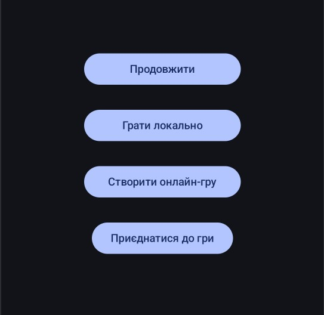
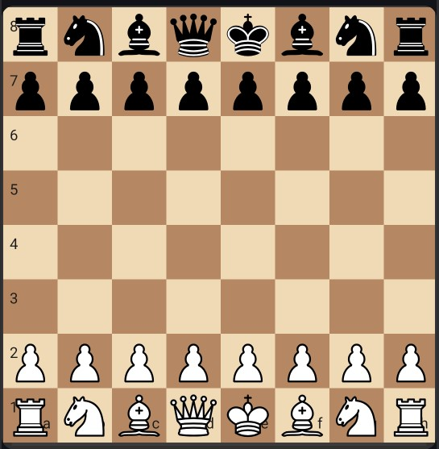

# ♟️ Chesstron – Мобільна шахова гра на Kotlin

**Chesstron** — це повноцінна шахова гра для Android-пристроїв, створена на мові програмування **Kotlin** з використанням **Jetpack Compose**. Гра підтримує режими:
- 🔁 гра на одному пристрої,
- 🤖 гра проти комп’ютера (бота),
- 🌐 онлайн-гра через Firebase.

---

## 🎯 Основні можливості

- ✅ Повна шахова логіка (усі правила та типи фігур)
- 🔄 Рокіровка, взяття на проході, промоція пішака
- 🧠 Базовий ШІ (бот)
- 📶 Онлайн-режим з лобі та синхронізацією через Firebase
- 🎨 Інтерактивна дошка з анімаціями та звуками
- ⏪ Історія ходів і можливість скасування (у певних режимах)
- 📱 Адаптація під різні екрани

---

## 🧩 Структура проєкту

```
com.example.chesstron/
├── bots/                # ШІ для гри проти комп’ютера
├── data/model/          # Моделі даних і шахові правила
├── domain/usecase/      # Логіка ініціалізації
├── presentation/        # ViewModel, UI-компоненти
├── ui/                  # Активності та інтерфейс
```

---

## 📲 Скриншоти

### ▶️ Головне меню


### ♟️ Ігрове поле


---

## 🚀 Як запустити

1. Відкрий проєкт у **Android Studio**.
2. Встанови **Firebase**:
   - Додай свій `google-services.json` до `app/`
3. Запусти додаток на емуляторі або реальному пристрої.

---

## 🧪 Тестування

У папці `test/` містяться юніт-тести, які перевіряють:
- Валідність ходів фігур
- Шах, мат, пат
- Неможливість недопустимих дій

Запустити можна через Android Studio або Gradle:

```bash
./gradlew test
```

---

## 🔮 Можливості для розвитку

- Додати контроль часу (таймер)
- Реєстрація гравців, рейтинг, історія партій
- Покращення ШІ за допомогою Stockfish
- Багатомовність (українська / англійська)
- Темна тема

---

## 👨‍💻 Автор

Розробник: **Зайцев А. М.**  
Проєкт створено в рамках індивідуального завдання з мобільної розробки.

---

## 📄 Ліцензія

Відкритий для навчального та некомерційного використання. Іконки фігур взяті з [Wikimedia](https://commons.wikimedia.org/wiki/Category:SVG_chess_pieces) (CC0).
